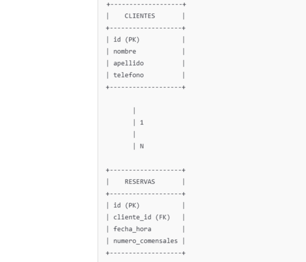

# Proyecto Java Individual - Sistema de Gestión de Reservas y Clientes

## Descripción

Este proyecto es una aplicación desarrollada en **Java** utilizando **Spring Boot** para la gestión de reservas y clientes. La aplicación permite realizar un CRUD completo (Crear, Leer, Actualizar y Eliminar) tanto para clientes como para reservas. Utiliza una base de datos en memoria (**H2 Database**) para almacenar los datos.

---

## Características

- **Gestión de Clientes**:
  - Crear nuevos clientes.
  - Consultar todos los clientes o uno en particular.
  - Actualizar la información de un cliente existente.
  - Eliminar un cliente.

- **Gestión de Reservas**:
  - Crear nuevas reservas asociadas a un cliente.
  - Consultar todas las reservas o una en particular.
  - Actualizar detalles de una reserva existente.
  - Eliminar una reserva.

- **Base de Datos H2**:
  - Configuración simple con consola habilitada.
  - Datos persistidos solo en memoria durante la ejecución de la aplicación.

---

## Tecnologías Utilizadas

- **Lenguaje**: Java 17
- **Framework**: Spring Boot
  - Spring Web
  - Spring Data JPA
- **Base de Datos**: H2 Database
- **Gestión de Dependencias**: Maven
- **Librerías**:
  - Lombok: Para simplificar la creación de getters, setters y constructores.
- **Herramientas de Desarrollo**:
  - Postman: Para probar los endpoints REST.
  - IntelliJ IDEA/Eclipse.

---

## Requisitos Previos

Asegúrate de tener instalados los siguientes programas:

1. **Java 17** o superior.
2. **Maven**.
3. Un IDE como IntelliJ IDEA, Eclipse o cualquier otro que prefieras.

---

## Configuración del Proyecto

1. Clonar el repositorio:
   ```bash
   git clone https://github.com/usuario/proyecto-java-individual.git
   cd proyecto-java-individual
  ## UML



## End Points


## Tests de Aceptación

Este proyecto incluye tests de aceptación para verificar el correcto funcionamiento de los controladores y la lógica relacionada. Los tests han sido implementados usando `MockMvc` y cubren las operaciones principales de las entidades **Cliente** y **Reserva**.

### Tests de Aceptación Realizados

#### ClienteControlador
- **Ver todos los clientes**: Prueba para obtener una lista de todos los clientes almacenados en la base de datos.
- **Ver cliente por ID**: Prueba para recuperar un cliente específico utilizando su ID.
- **Crear cliente**: Prueba para crear un nuevo cliente y validar su almacenamiento.
- **Actualizar cliente**: Prueba para modificar un cliente existente.
- **Eliminar cliente**: Prueba para eliminar un cliente y asegurar que ya no esté disponible.

#### ReservaControlador
- **Ver todas las reservas**: Prueba para obtener una lista de todas las reservas almacenadas en la base de datos.
- **Ver reserva por ID**: Prueba para recuperar una reserva específica utilizando su ID.
- **Crear reserva**: Prueba para crear una nueva reserva, asociándola con un cliente existente.
- **Actualizar reserva**: Prueba para modificar una reserva existente, incluyendo datos relacionados con el cliente.
- **Eliminar reserva**: Prueba para eliminar una reserva y asegurar que ya no esté disponible.

### Herramientas Utilizadas
- **MockMvc**: Para simular peticiones HTTP y validar las respuestas del controlador.
- **Spring Boot Test**: Framework de pruebas integrado en Spring Boot.
- **Junit 5**: Para la ejecución de los tests.

Los tests garantizan que las funcionalidades del proyecto sean robustas y cumplan con los requisitos establecidos.


## Contacto creador
|                                                                                **Juan Ignacio Fauró**                                                                                 |
|:-------------------------------------------------------------------------------------------------------------------------------------------------------------------------------------:|
|            <a href="https://github.com/juanignacioFG"> </a>            |
 <a href="https://www.linkedin.com/in/juan-ignacio-fauro/"> </a> |